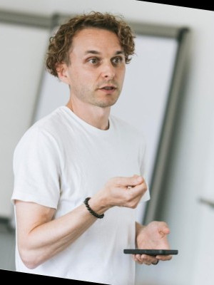
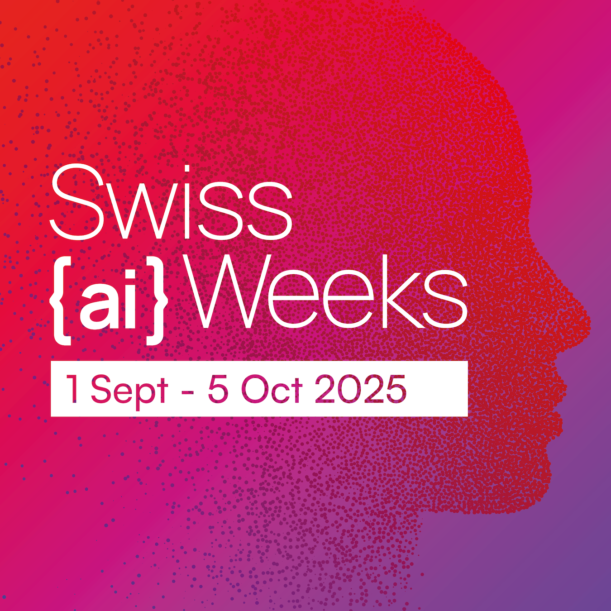

# Swiss {ai} Weeks Lausanne - Practical information

Come join us for the fun an innovative hackathon exploring AI technologies! Let's build exciting projects together 🎉

[1. General Information](#1-general-information)  
[2. Themes](#2-themes)  
[3. Resources](#3-resources)  
[4. Schedule](#4-schedule)  
[5. Team Formation](#5-team-formation)  
[6. Submission Process](#6-submission-process)  
[7. Communication](#7-communication)  
[8. Guidelines](#8-guidelines)  
[9. Evaluation Criteria](#9-evaluation-criteria)  
[10. Jury](#10-jury)  
[11. Acknowledgements](#11-acknowledgements)

## 1. General Information

### **Date & Time:**

- **Date:** Friday, September 26 to Saturday, September 27
- **Time:** 8:00 AM (Sep 26) - 8:00 PM (Sep 27)

### **Location:**

- [EPFL AI Center Lounge](https://plan.epfl.ch/?room==ELE%20117) (ELE 117) + surrounding rooms

## 2. Theme

The Swiss {ai} Weeks are hackathons aimed at turning AI research into real societal and economic impact. Through hackathons, expert events, public programs, and startup support, they bring together researchers, developers, entrepreneurs, and citizens to promote ethical, open, and trustworthy AI. A key focus is Switzerland’s first open-source language model, built on values like transparency, responsibility, and multilingualism.

## 4. Schedule

**Friday, September 26 :**

- **8:00**: Registration and breakfast
- **10:00 - 10:15**: Opening ceremony
- **10:20 - 11:40**: Tech talks
- **11:40 - 12:00**: Team building
- **12:00**: Hacking starts
- **12:00 - 13:00**: Lunch
- **18:30 - 19:30**: Dinner

**Saturday, September 27**:

- **0:00 - 1:00**: Midnight snack
- **7:00 - 9:00**: Breakfast
- **12:00**: Hacking ends
- **11:30 - 12:30**: Lunch
- **12:30 - 15:00**: Judging
- **15:00 - 17:00**: Closing ceremony
- **17:00 - 19:00**: Closing apéro (optional)

## 5. Team Formation

Up to 5 members per team. Register your team [here](https://docs.google.com/spreadsheets/d/1WReOKpRpRoAy1omIYhKk0Jx6MZCWK9rJo9Mws4yhp7s/edit?usp=sharing).

## 6. Submission Process

⚠️ All projects should be submitted on [DevPost]() LINK TBA.
And make sure your team is up-to-date in the [team formation document](https://docs.google.com/spreadsheets/d/1WReOKpRpRoAy1omIYhKk0Jx6MZCWK9rJo9Mws4yhp7s/edit?usp=sharing).

In order to be considered for a prize, **all projects should demo/present (3 minutes) on Saturday afternoon**.

## 7. Communication

Real-time information about the event, food service details, and questions related to the challenges will be posted in our personal Discord server (`#2025-saiw-lausanne` channel). Please use the link sent to you via Luma (to get access to the private channel for this event).

Important announcements will be posted in the `#2025-saiw-announcement` discord channel.

## 8. Guidelines

General Guidelines are provided by the [following document](https://shorturl.at/h78NZ) Please make sure you have read them before attending the event.

## 9. Evaluation Criteria

Only work done during hackathon will be considered (and should be made explicit) for the project evaluation.

| Criteria                                                                                                                  | Allocated points |
| ------------------------------------------------------------------------------------------------------------------------- | ---------------- |
| **1. Technical Impressiveness**                                                                                           | **6**            |
| &nbsp;&nbsp; 1.1. How impressive is the project from a technical perspective?                                             | 3                |
| &nbsp;&nbsp; 1.2. How reasonable the technical and programming solutions are, given the limited timeframe of a hackathon? | 3                |
| **2. Idea**                                                                                                               | **6**            |
| &nbsp;&nbsp; 2.1. How innovative, original and unexpected the project is?                                                 | 3                |
| &nbsp;&nbsp; 2.2. How usable the idea is for the real-world target population to which the project is aimed? hackathon?   | 3                |
| **3. Prototype**                                                                                                          | **8**            |
| &nbsp;&nbsp; 3.1. Does the prototype work as advertised by the team, and as expected for a one-day project?               | 4                |
| &nbsp;&nbsp; 3.2. Does the prototype provide a good user experience and usability?                                        | 4                |
| **4. Presentation**                                                                                                       | **4**            |
| **5. Integrity Check**                                                                                                    |                  |
| **TOTAL**                                                                                                                 | **24**           |

## 10. Jury

<table align="center">
  <tr>
    <td align="center" width="20%">
      <a href="https://people.epfl.ch/andrea.cavallaro">
        
         
        <b>Prof. Andrea Cavallaro</b>
      </a>
    </td>
    <td align="center" width="20%">
      <a href="https://zurich.impacthub.ch/en/community/beat-seeliger/">
        
         
        <b>Beat Seeliger</b>
      </a>
    </td>
    <td align="center" width="20%">
      <a href="https://www.open-systems.com/leadership/marta-martinez/">
        
         
        <b>Marta Martinez</b>
      </a>
    </td>
    <td align="center" width="20%">
      <a href="https://www.linkedin.com/in/danieldobos/">
        
         
        <b>Dr. Daniel Dobos</b>
      </a>
    </td>
    <td align="center" width="20%">
      <a href="https://people.epfl.ch/seyed.neshaei">
        
         
        <b>Seyed Parsa Neshaei</b>
      </a>
    </td>
  </tr>
</table>

## 11. Acknowledgements

A BIG thank you to the [EPFL AI Team](https://epflaiteam.ch) for co-hosting the event, to the [EPFL AI Center](https://ai.epfl.ch/) for hosting, and to [Swisscom](https://www.swisscom.ch) and the [Swiss {ai} Weeks](https://swiss-ai-weeks.ch/) for sponsoring and letting us organise this event!

<table align="center">
  <tr>
    <td align="center" valign="top" width="50%">
      <a href="https://swiss-ai-weeks.ch/">
        
         
        <b>Swiss {ai} Weeks</b>
      </a>
    </td>
    <td align="center" valign="top" width="50%">
      <a href="https://www.swisscom.ch">
        
         
        <b>Swisscom</b>
      </a>
    </td>
  </tr>
</table>

Thank you also to the labs of [Prof. Touradj Ebrahimi](https://www.epfl.ch/labs/mmspg/), [Prof. Sabine Süsstrunk](https://www.epfl.ch/labs/ivrl/), [Prof. Sébastien Marcel](https://www.idiap.ch/en/scientific-research/biometrics-security-and-privacy) for providing/proposing content.
