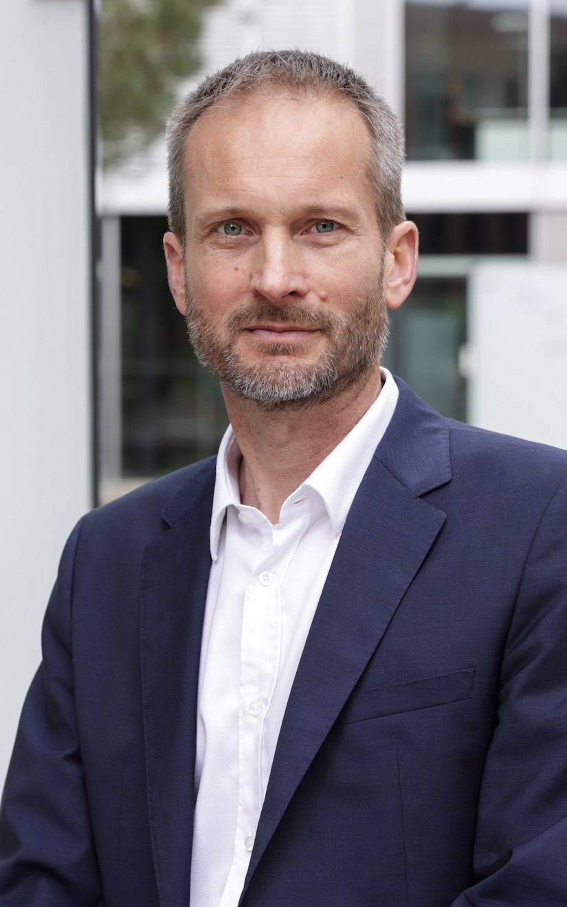
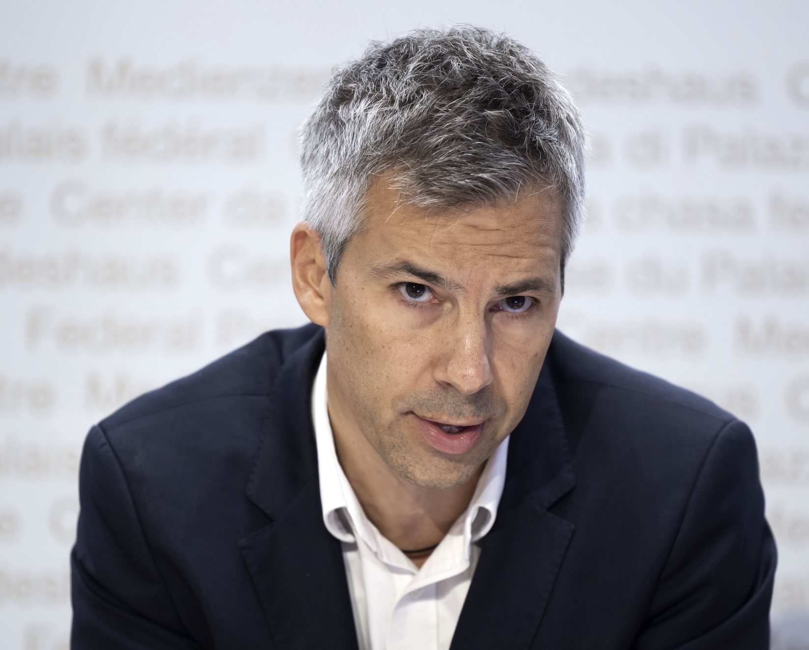
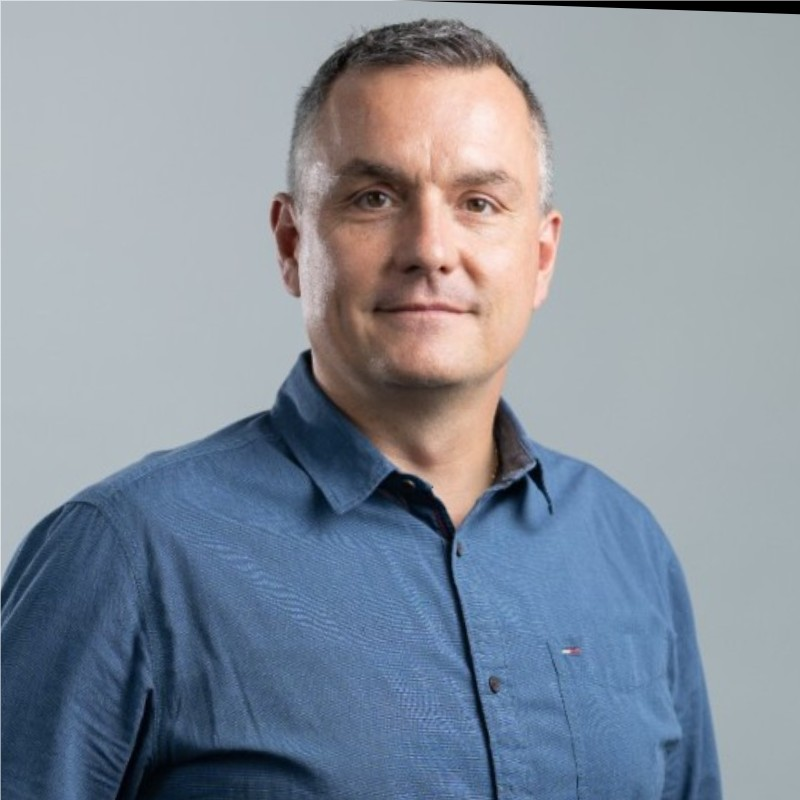

# DeepFake Mini-Hackathon Wiki

Come join us for a fun and innovative hackathon exploring the DeepFake technology! Let's build exciting projects together 🎉

[1. General Information](#1-general-information)  
[2. Themes](#2-themes)  
[3. Resources](#3-resources)  
[4. Schedule](#4-schedule)  
[5. Team Formation](#5-team-formation)  
[6. Submission Process](#6-submission-process)  
[7. Communication](#7-communication)  
[8. Guidelines](#8-guidelines)  
[9. Evaluation Criteria](#9-evaluation-criteria)  
[10. Jury](#10-jury)  
[11. Acknowledgements](#11-acknowledgements)

## 1. General Information

### **Date & Time:**

- **Date:** Friday, September 13 to Saturday, September 14
- **Time:** 6:00 PM - 10:00 PM (Sep 13) to 10:00 AM - 5:00 PM (Sep 14)

### **Location:**

- Those with "Approved" status on [Luma](https://lu.ma/faw7lqzg): [EPFL AI Center Lounge](https://plan.epfl.ch/?room==ELE%20117) (ELE 117)
- Everyone else: [Zoom](https://epfl.zoom.us/j/63964720958)

## 2. Themes

[LauzHack](https://lauzhack.com/) is hosting a mini-hackathon with two exciting tracks:

1. **Generation (red team)**

2. **Detection (blue team)**

## 3. Resources

Generation:

- Face swap tools: https://analyticsindiamag.com/topics/best-face-swap-ai-tools/
- Real-time face swap: https://github.com/hacksider/Deep-Live-Cam
- List of generation resources: https://github.com/Daisy-Zhang/Awesome-Deepfakes
- Hugging Face course on Diffusion models: [https://www.deeplearning.ai/short-courses/open-source-models-hugging-face/](https://huggingface.co/learn/diffusion-course)
- (Login required) Short courses from DeepLearning.ai (LangChain, RAG, Vector Databases, etc): https://learn.deeplearning.ai/

Detection:

- List of detection resources: https://github.com/Daisy-Zhang/Awesome-Deepfakes-Detection
- Image detection challenge dataset: https://www.dfad.unimore.it/challenge/
- Speaker verification and spoofing: https://www.asvspoof.org/
- Partially spoofed audio dataset: https://zenodo.org/records/5766198
- In-the-wild audio deepfakes from politicians and public figures: https://deepfake-total.com/in_the_wild, https://arxiv.org/pdf/2404.13914

Compute / demo:

- You can message `Eric (organizer)` on the LauzHack Discord for an OpenAI key!
- Google Colab for GPU compute: https://colab.research.google.com/
- Getting started with EPFL clusters: https://github.com/epfml/getting-started-lauzhack/
- [Gradio](https://www.gradio.app/) for hosting a demo.

## 4. Schedule

**Friday, September 13 (on Zoom for those without the Luma registration approval):**

- 6:00 PM: Tutorials/Workshops (AI Center Lounge)
  - Talks/Tutorials
  - Pizza
  - Spontaneous tutorials based on people's interests
- 10:00 PM: End of day. You CANNOT stay overnight, but you can continue working remotely.

**Saturday, September 14 (only for participants whose Luma registration was approved):**

- 10:00 AM: Breakfast (AI Center Lounge)
- Until 3:00 PM: Hack, hack, hack!
- 3:30 PM: Demos (for everyone) then prizes 🏆

😋 We will provide dinner on Friday and (breakfast, lunch) on Saturday.

## 5. Team Formation

Up to 4 members per team. Register your team [here](https://docs.google.com/spreadsheets/d/1lQeFlzjDy1dwIb50kOTt-Wri43hVQuff9qrje67wXnY/edit?usp=sharing).

## 6. Submission Process

⚠️ All projects should be submitted on [DevPost](https://deepfake-epfl-hackathon.devpost.com/).
And make sure your team is up-to-date in the [team formation document](https://docs.google.com/spreadsheets/d/1lQeFlzjDy1dwIb50kOTt-Wri43hVQuff9qrje67wXnY/edit?usp=sharing).

In order to be considered for a prize, **all projects should demo/present (3 minutes) on Saturday afternoon**.

When submitting your project, in the Additional info step, please select the track that you are doing (Generation or Detection) as in the attached image.

## 7. Communication

Real-time information about the event, food service details, and questions related to the challenges will be posted in our personal Discord server (`#deepfake-sep2024` channel). Please use the link sent to you via Luma (to get access to the private channel for this event).

## 8. Guidelines

General Guidelines are provided by the [LauzHack rules](https://lauzhack.com/pdf/rules.pdf), though if you choose to be part of a red team, the following additional guidelines apply.

As deep fakes are a sensitive topic, and this hackathon explores both blue team (defensive) and red team (offensive) approaches, special rules apply. **The following rule applies to everyone in attendance: Consider this a private event. Do not record any deep fakes created during the hackathon. If you have any question regarding this rule, ask the organizers first. This is very important as you might be liable for any harm caused by your actions.**

The following additional rules apply to the Red team:

### Generation track (Red Team) Rules

Our goal is not to limit your creativity - on the contrary, we encourage you to push the boundaries and show us what’s possible! However, it’s important that your well-intioned work does not inadvertently cause harm.

- As a principle, do not create deep fakes of real people
- For public figures (famous people for which there is a lot of content online), you are allowed to create deep fakes _in the scope of this event_ - see additional rules below
- Every deep fake you create must be very clearly labeled as such
- Refrain from producing deeply offensive content
- No sharing or publishing of generated content or code outside the event without review
- If in doubt: please regularly check-in with organizers to ensure adherence to guidelines

## 9. Evaluation Criteria

Only work done during hackathon will be considered (and should be made explicit) for the project evaluation.

| Criteria                                                                                                                  | Allocated points |
| ------------------------------------------------------------------------------------------------------------------------- | ---------------- |
| **1. Technical Impressiveness**                                                                                           | **6**            |
| &nbsp;&nbsp; 1.1. How impressive is the project from a technical perspective?                                             | 3                |
| &nbsp;&nbsp; 1.2. How reasonable the technical and programming solutions are, given the limited timeframe of a hackathon? | 3                |
| **2. Idea**                                                                                                               | **6**            |
| &nbsp;&nbsp; 2.1. How innovative, original and unexpected the project is?                                                 | 3                |
| &nbsp;&nbsp; 2.2. How usable the idea is for the real-world target population to which the project is aimed? hackathon?   | 3                |
| **3. Prototype**                                                                                                          | **8**            |
| &nbsp;&nbsp; 3.1. Does the prototype work as advertised by the team, and as expected for a one-day project?               | 4                |
| &nbsp;&nbsp; 3.2. Does the prototype provide a good user experience and usability?                                        | 4                |
| **4. Presentation**                                                                                                       | **4**            |
| **5. Integrity Check**                                                                                                    |                  |
| **TOTAL**                                                                                                                 | **24**           |

## 10. Jury

<table align="center">
  <tbody>
    <tr>
      <td align="center" valign="top" width="25%">
        <a href="https://people.epfl.ch/sabine.susstrunk">
          
           <b>Prof. Sabine Süsstrunk</b>
        </a>
      </td>
      <td align="center" valign="top" width="25%">
        <a href="https://people.epfl.ch/pascal.frossard">
          
           <b>Prof. Pascal Frossard</b>
        </a>
      </td>
      <td align="center" valign="top" width="25%">
        <a href="https://people.epfl.ch/marcel.salathe">
          
           <b>Prof. Marcel Salathé</b>
        </a>
      </td>
      <td align="center" valign="top" width="25%">
        <a href="https://people.epfl.ch/touradj.ebrahimi">
          
           <b>Prof. Touradj Ebrahimi</b>
        </a>
      </td>
    </tr>
    <tr>
      <td align="center" valign="top" width="25%" style="border: none; padding: 0; background-color: transparent;">
      </td>
      <td align="center" valign="top" width="25%">
        <a href="https://www.linkedin.com/in/danieldobos/">
          
           <b>Dr. Daniel Dobos</b>
        </a>
      </td>
      <td align="center" valign="top" width="25%">
        <a href="https://www.linkedin.com/in/jchardon/">
          
           <b>Mr. Jean-Michel Chardon</b>
        </a>
      </td>
      <td align="center" valign="top" width="25%" style="border: none; padding: 0; background-color: transparent;">
      </td>
    </tr>
  </tbody>
</table>

## 11. Acknowledgements

A BIG thank you to the [EPFL AI Center](https://ai.epfl.ch/) for co-hosting and co-organizing this event, and to [Swisscom](https://www.swisscom.ch) and [Logitech](https://www.logitech.com) for sponsoring this event!

<table align="center">
  <tr>
    <td align="center" valign="top" width="50%">
      <a href="https://www.logitech.com">
        
         
        <b>Logitech</b>
      </a>
    </td>
    <td align="center" valign="top" width="50%">
      <a href="https://www.swisscom.ch">
        
         
        <b>Swisscom</b>
      </a>
    </td>
  </tr>
</table>

Thank you also to the labs of [Prof. Touradj Ebrahimi](https://www.epfl.ch/labs/mmspg/), [Prof. Sabine Süsstrunk](https://www.epfl.ch/labs/ivrl/), [Prof. Sébastien Marcel](https://www.idiap.ch/en/scientific-research/biometrics-security-and-privacy) for providing/proposing content.
